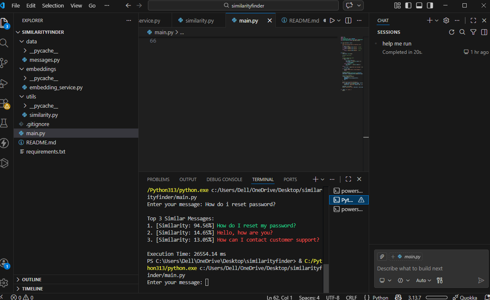

# Message Similarity Finder

## Overview
The Message Similarity Finder is a terminal-based Python application that identifies semantically similar messages using Natural Language Processing techniques. It converts text messages into numerical vectors and compares them using cosine similarity to return the most relevant results.

This project is implemented using local libraries only and does not rely on any external APIs.

---

## Objectives
- Convert textual messages into numerical representations
- Compare user input with stored messages
- Identify and display the most similar messages
- Ensure all processing is done locally and efficiently

---

## Features
- TF-IDF based text vectorization
- Cosine similarity for semantic comparison
- Returns top-K similar messages
- Similarity score displayed as percentage
- Color-coded output based on similarity level
- Execution time measurement
- Fully offline implementation (no APIs)

---

## Tech Stack
- Python 3.8+
- scikit-learn
- NumPy

---

## Project Structure
```
similarityfinder/
├── main.py
├── data/
│ └── messages.py
├── embeddings/
│ └── embedding_service.py
├── utils/
│ └── similarity.py
├── requirements.txt
├── README.md
└── .gitignore

```

---

## Setup Instructions


###1.Clone the repository
```bash 
git clone https://github.com/meow-0109/similarityfinder.git
cd similarityfinder
```

###2. Create virtual environment
```python -m venv venv```

###3.Install dependencies
```pip install -r requirements.txt```

 How to run
```main.py Enter your MEssage:```

Results
Example 1

Input:
```Enter your Message: How do i reset Password?```

Output:
```Top 3 Similar Messages: 
1. [Similarity: 94.56%] How do I reset my password?
2. [Similarity: 14.65%] Hello, how are you?
3. [Similarity: 13.05%] How can I contact customer support?

Execution Time: 26554.14 ms
```
Example 2

Input 
```Enter your Message: (Empty)```

Output:

```Top 3 Similar Messages:
1. [Similarity: 0.00%] Hello, how are you?
2. [Similarity: 0.00%] Good morning, can you help me? 
3. [Similarity: 0.00%] Hi there!      

Execution Time: 154154.88 ms
```


### Output Screenshot



